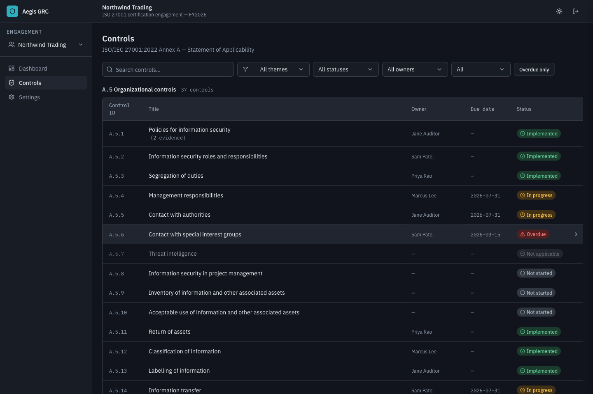
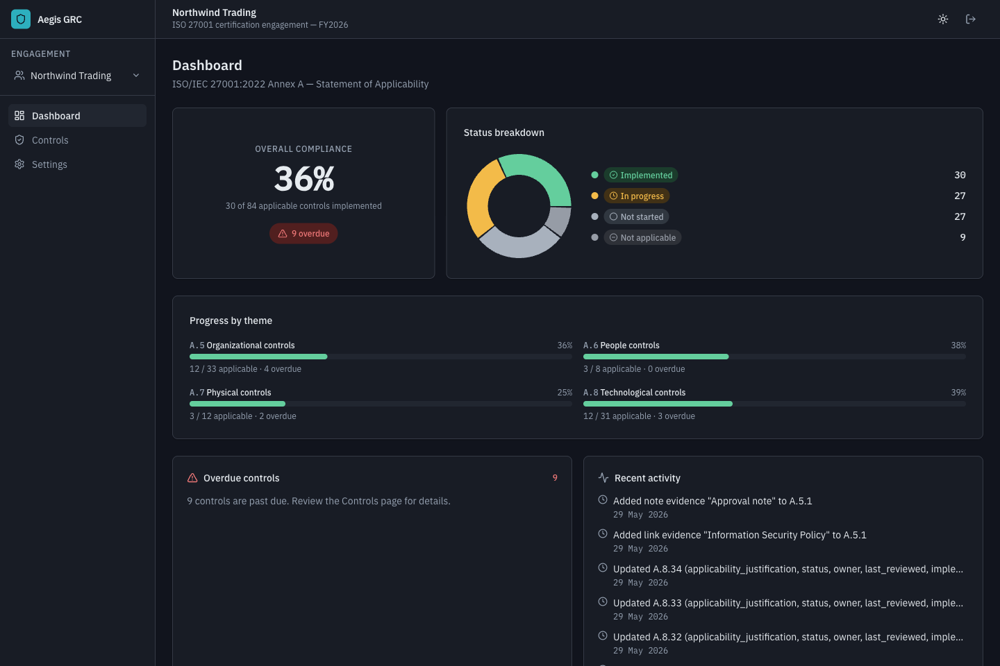

# Aegis GRC

A self-hosted web app for a GRC consultant to track **ISO/IEC 27001:2022 Annex A
controls** across multiple client engagements. Each engagement gets its own
Statement of Applicability — all 93 Annex A controls — to work through:
applicability, implementation status, owners, evidence, due dates, and review notes.

**Everything lives in one encrypted file, in one Docker container, unlocked by one
master password.** Stand up a fresh instance anywhere, drop that file in, log in —
all your data (including uploaded evidence files) is right there.

<p align="center">
  
</p>

<p align="center">
  
  
</p>

> First-class **light and dark** themes; the controls table groups all 93 controls
> by theme with a color-blind-safe status palette (status is never color alone —
> always an icon + label).

---

## Why it exists

- 🔒 **Encrypted at rest** — the entire datastore is a single
  SQLCipher-encrypted SQLite file (`aegis.db`): AES-256, PBKDF2 KDF, HMAC-SHA512.
  The **master password *is* the key**. It is never stored anywhere; the KDF salt
  lives in the file header, so there is no sidecar key or salt file.
- 📦 **One container, one file** — embedded database, in-process, no external
  database server and no external services to run.
- 🔑 **One password** both gates the UI and unlocks the data. Container start ⇒
  locked ⇒ unlock required.
- 🧳 **Trivial migration** — back up = download the one file; restore = drop it
  into a fresh instance and unlock. (Proven end-to-end; see `VALIDATION.md`.)
- 🎨 **Polished, professional UI** — self-hosted IBM Plex, restrained slate
  palette with one accent, dashboard with charts, filterable controls table, and
  a detail drawer for editing controls + managing evidence.

> ⚠️ **There is no password recovery.** The password is the encryption key — by
> design, losing it means the data is unrecoverable. Keep it safe and keep backups.

---

## Quick start (first time)

You need **[Docker](https://docs.docker.com/get-docker/)** (with Docker Compose,
included in Docker Desktop). That's the only prerequisite to *run* it.

```bash
# 1. Clone the repository
git clone https://github.com/sm-coding-projects/Aegis-GRC.git
cd Aegis-GRC

# 2. Build and start (first build takes a few minutes: it compiles the native
#    SQLCipher addon and builds the web app)
docker compose build
docker compose up -d
```

Then open **https://localhost:8443** in your browser.

- Your browser will warn about the certificate — that's the **self-signed cert**
  generated on first start. For local use, click through ("Advanced → proceed").
  See [TLS](#tls) to use a real certificate.
- On **first run** you'll be asked to **create a master password** (this
  initializes and encrypts the database). On later runs you'll **unlock** with it.
- Create your first **client engagement** — it's seeded with all 93 Annex A
  controls, ready to work through.

Your data is stored on the host at **`./data/aegis.db`** (a Docker volume mount).
To stop the app: `docker compose down` (your data stays on disk).

### Linux note (file permissions)
The container runs as a non-root user (uid `1000`). On Linux, make the data
directory writable by it before the first start:
```bash
mkdir -p data certs && sudo chown -R 1000:1000 data certs
```
On macOS / Windows Docker Desktop this is handled automatically.

---

## Backup

Your entire dataset is the single file `aegis.db`. Two ways to back it up:

1. **In-app (recommended):** Settings → **Download backup**. The server
   checkpoints the database and streams a self-contained, still-encrypted
   `aegis-backup-<date>.db`.
2. **From disk:** `docker compose down` (so the file is checkpointed and
   self-contained), then copy `./data/aegis.db` somewhere safe.

The backup is encrypted with your master password — it's useless without it.

## Restore / move to a new machine

This is the headline workflow, verified end-to-end (see `VALIDATION.md`).

**Option A — drop the file in (greenfield):**
```bash
git clone https://github.com/sm-coding-projects/Aegis-GRC.git && cd Aegis-GRC
mkdir -p data
cp /path/to/your/aegis.db ./data/aegis.db    # Linux: then chown to uid 1000
docker compose up -d
```
Open the app and **unlock with your original master password** — all clients,
controls, and evidence (including uploaded files) are present.

**Option B — upload via the UI:** on a brand-new instance, the first-run screen
offers **"Restore from backup instead"** → choose your `aegis.db` → then unlock
with the original password.

A wrong password is always rejected with a generic error; the file is never
readable without it.

---

## TLS

The app serves **HTTPS** directly, so the container truly holds everything.

- **Use your own certificate (recommended beyond localhost):** put
  `fullchain.pem` and `privkey.pem` in `./certs` — they're mounted to `/certs`
  (already wired in `docker-compose.yml`) and used automatically.
- **No certificate mounted:** a **self-signed** cert is generated on first start.
  Browsers warn; fine for localhost / trusted LAN, **not** for untrusted networks.
- **Production:** terminate TLS at a reverse proxy (Caddy / Traefik / nginx) in
  front, with Aegis on the internal network. The single-container path still works
  on its own.

## Configuration

All optional (see `.env.example`); defaults are baked into the image.

| Variable | Default | Meaning |
|---|---|---|
| `PORT` | `8443` | HTTPS listen port |
| `IDLE_TIMEOUT_MIN` | `30` | Auto-lock + destroy session after this much inactivity |
| `DATA_DIR` | `/data` | Where `aegis.db` lives (volume mount) |
| `CERTS_DIR` | `/certs` | Where `fullchain.pem` / `privkey.pem` are read from |
| `MAX_EVIDENCE_BYTES` | `10485760` | Max size of a single uploaded evidence file (10 MB) |

## Security at a glance

- **Master password is never persisted** — not in env, on disk, or in logs; it
  exists only as the in-memory key of the open DB connection.
- **Sessions:** `HttpOnly` + `SameSite=Strict` cookie, `Secure` over HTTPS,
  tied to the in-memory unlocked handle. Logout and idle-timeout both re-lock.
- **CSRF:** `SameSite=Strict` + a required per-session `X-CSRF-Token` header on
  mutations; bootstrap auth routes require a custom `X-Requested-With` header.
- **Brute force:** unlock route rate-limited (5 / 15 min / IP) with generic errors.
- **Headers:** `helmet` + HSTS + strict CSP (no inline scripts).
- **Container:** non-root, all Linux capabilities dropped, `no-new-privileges`;
  `data/`, `certs/`, and `.env` are excluded from the image.

---

## Development

Monorepo (npm workspaces): `shared/` (zod schemas + types — the single source of
validation truth), `server/` (Express + TypeScript), `client/` (React + Vite +
Tailwind + Radix/shadcn).

```bash
npm install          # Node 22 required
npm run dev          # server (8443, HTTPS) + client (5173, proxies /api)

npm run typecheck    # all workspaces
npm run lint
npm test             # Vitest: server (supertest/integration) + client (component)
npm run test:e2e     # Playwright happy path (boots a real HTTPS server)
npm run build        # shared + client
```

Full validation drill against real containers:
```bash
docker compose build && bash scripts/migration-drill.sh
```

**Tech:** TypeScript end-to-end · Node 22 · Express · `better-sqlite3-multiple-ciphers`
(SQLCipher v4) · React + Vite · Tailwind + Radix/shadcn · TanStack Query ·
react-hook-form + zod · Recharts · Vitest + supertest + Playwright · multi-stage
Debian Docker image.

See **`CLAUDE.md`** for the full design/requirements spec and **`VALIDATION.md`**
for phase-by-phase validation evidence (including the migration drill transcript).

## Scope (v1)

Controls tracking + per-client SoA + dashboard. Intentionally **not** in v1 (clean
extension points left, not built): multi-user / RBAC, cloud sync, external auth,
telemetry, risk/asset registers.
